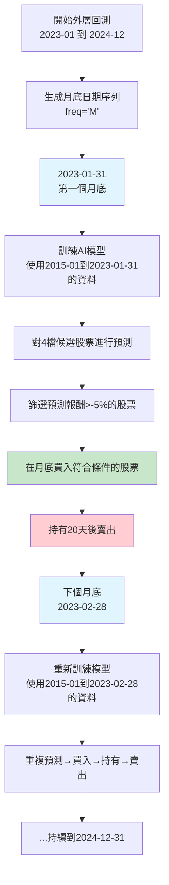
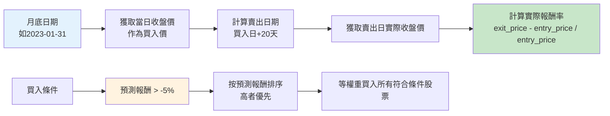
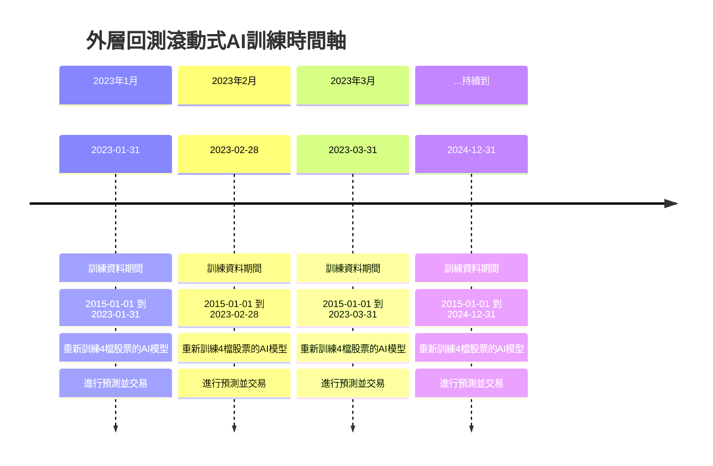

# 外層回測流程圖表

本文件包含選單5外層回測的詳細流程圖表，用於說明交易時機和AI模型訓練機制。

## 1. 外層回測交易時機流程圖

## 2. 交易執行細節流程圖

## 3. 滾動式AI模型訓練時間軸

## 關鍵說明

### 交易頻率與時機
- **交易頻率**：每月一次（月底）
- **買入時機**：每個月最後一個交易日
- **持有期間**：固定20天
- **不是每日交易**：系統不會每天檢查股價來決定買賣

### AI模型重訓練機制
- **頻率**：每個月重新訓練一次
- **訓練資料**：從2015-01-01到當前月底的所有資料
- **模型更新**：每次都是完全重新訓練，不是增量學習
- **個股專屬**：每檔股票都有自己的最佳參數模型

### 完整流程
1. **月底觸發**：每個月最後一天
2. **重新訓練**：用最新資料重訓4檔股票的AI模型
3. **預測報酬**：對每檔股票預測未來20天報酬
4. **篩選股票**：選擇預測報酬>-5%的股票
5. **等權買入**：在月底收盤價買入
6. **持有20天**：固定持有期間
7. **自動賣出**：20天後以收盤價賣出
8. **下月重複**：進入下個月循環

### 實際結果
- **測試期間**：2023-01 到 2024-12（24個月）
- **總交易數**：57筆
- **總報酬率**：73.45%
- **勝率**：66.7%
- **候選股票**：1314, 1309, 1319, 1215（4檔）
